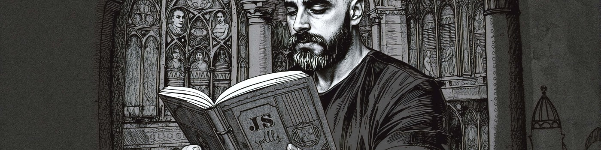

  

  

<h1 align="center">¡Hola 👋! Soy Chema Alfonso</h1>

Desarrollador y diseñador de software apasionado por la tecnología 👨🏻‍💻.

  Creado con <a href="https://github.com/ChemaAlfonso/Ascii-live-renderer">Ascii Live Renderer</a> (<a href="https://chemaalfonso.github.io/Ascii-live-renderer">Vista previa</a>)

---

## 🌟 Sobre mí

  

Desde muy joven, descubrí mi pasión por la tecnología. A los 12 años, creé mi primera página web personal, lo que marcó el inicio de mi viaje en este fascinante mundo. He aprendido de manera autodidacta, sumergiéndome en cursos en línea, artículos, documentación oficial e investigación propia. Además, he cursado DAW en igformacion y análisis y diseño de software en la UCAM.

Hoy en día, ofrezco mis servicios como desarrollador y diseñador de software a través de **Kraken Labs Web**, donde me esfuerzo por proporcionar un servicio de alto valor y satisfacción a mis clientes.

---

## 🌐 Mis redes

-   **Página profesional:** [Kraken Labs Web](https://krakenlabsweb.com)
-   **Página personal:** [Chema Alfonso](https://chemaalfonso.com)

---

## 📫 ¡Conectemos!

Si deseas hablar sobre proyectos, colaboraciones o simplemente intercambiar ideas, no dudes en contactarme a través de mis redes o por correo electrónico.

  <a href="mailto:hola@chemaalfonso.com">Enviar un correo</a>

---

  <i>“Cuanto más grande es la prueba, más glorioso es el triunfo.” - Thomas Paine</i>

